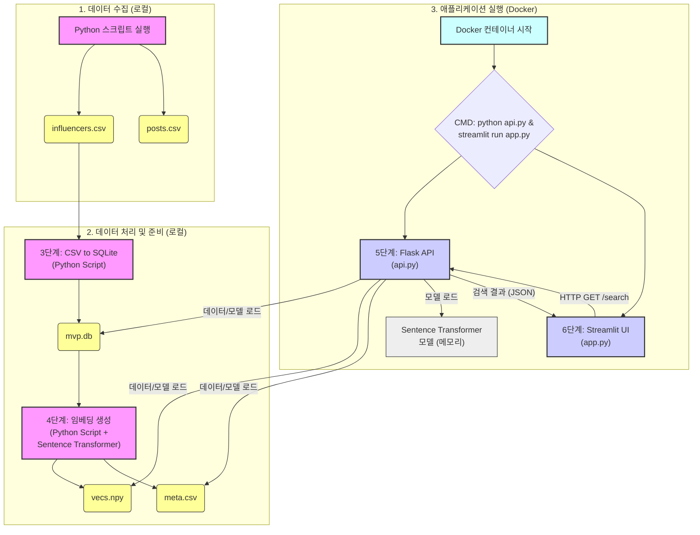

# 인스타 인플루언서 검색 MVP

## Sprint 1 워크플로우

아래는 현재 프로젝트(Sprint 1)의 데이터 처리 및 애플리케이션 실행 흐름을 나타내는 다이어그램입니다.

**주요 구성 요소:**

*   **데이터 수집:** 로컬 환경에서 Python 스크립트를 실행하여 `.csv` 파일 생성 (현재 데이터 관련성 문제 있음)
*   **데이터 처리 및 준비:** 로컬 환경에서 `.csv` 파일을 SQLite DB로 변환하고, 사용자 이름 임베딩 벡터(`.npy`)와 메타데이터(`.csv`) 생성
*   **애플리케이션 실행 (Docker):**
    *   Docker 컨테이너는 Flask API 서버(`api.py`)와 Streamlit UI(`app.py`)를 함께 실행합니다.
    *   Streamlit UI는 사용자의 검색 요청을 받아 Flask API에 HTTP GET 요청을 보냅니다.
    *   Flask API는 미리 준비된 임베딩 벡터, 메타데이터, Sentence Transformer 모델을 로드하여 검색어와 가장 유사한 사용자 목록을 찾아 JSON 형태로 Streamlit UI에 반환합니다. 