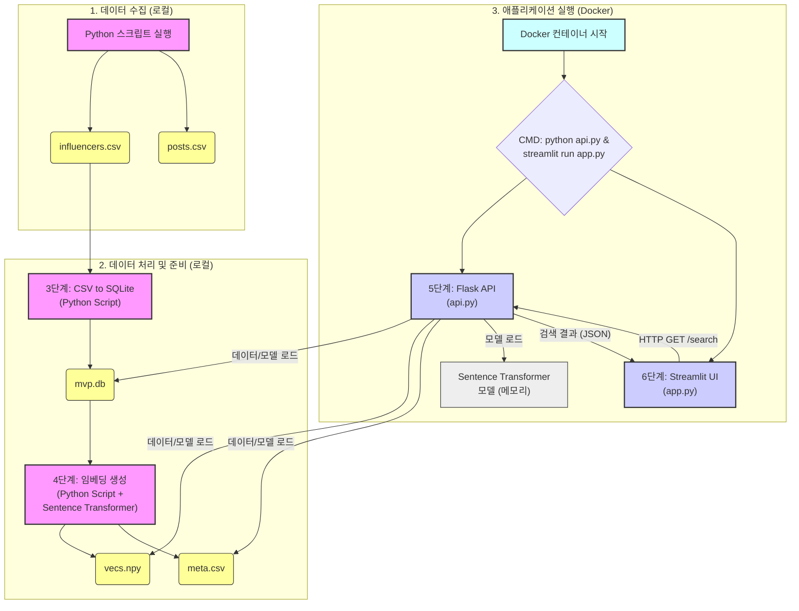

# 📈 인스타 인플루언서 검색 MVP (Sprint 2 - Week 2 완료)

간단한 자연어 쿼리를 통해 인스타그램 인플루언서를 검색하는 MVP 프로젝트입니다. **Week 1에서는 자연어 쿼리에서 팔로워 수 범위를 추출하여 필터링하는 기능과 텍스트 유사도 기반 검색 기능을 구현했습니다. Week 2에서는 렌즈 관련 데이터 수집 및 API 통합 기능이 추가되었습니다.**

## Setup

1.  **저장소 복제:**
    ```bash
    git clone <repository_url>
    cd <repository_directory>
    ```
2.  **가상 환경 생성 및 활성화:**
    ```bash
    python -m venv .venv
    # Windows
    .\.venv\Scripts\activate
    # macOS/Linux
    source .venv/bin/activate
    ```
3.  **필요 라이브러리 설치:**
    ```bash
    pip install -r requirements.txt
    # (konlpy 사용 시 JDK 설치 및 JAVA_HOME 환경 변수 설정 필요)
    ```
4.  **.env 파일 작성:**
    *   프로젝트 루트에 `.env` 파일을 생성하고 다음 내용을 입력합니다.
      ```dotenv
      INSTAGRAM_USERNAME=your_instagram_username
      INSTAGRAM_PASSWORD=your_instagram_password
      ```

## 데이터 준비 (Data Pipeline)

1.  **인스타그램 데이터 스크래핑:**
    *   (선택사항) `scraper.py` 상단의 `TARGET_HASHTAGS`, `MAX_USERS_TO_COLLECT`, `HASHTAG_MEDIA_COUNT` 등을 조절합니다.
    *   스크립트를 실행하여 인플루언서 및 게시물 데이터를 수집합니다.
      ```bash
      python src/data/scraper.py
      ```
    *   (선택사항) `scraping_log.md` 파일에 실행 결과를 기록합니다.
2.  **ETL 및 API 처리:**
    *   스크래핑 결과를 SQLite 데이터베이스에 저장하고 API 호출을 통해 추가 데이터를 생성합니다.
      ```bash
      python src/data/etl.py
      ```
    *   ETL 결과 검증:
      ```bash
      python verify_etl.py
      ```
3.  **임베딩 벡터 생성:**
    *   수집된 인플루언서의 자기소개를 벡터화하여 검색에 사용될 파일을 생성합니다.
      ```bash
      python scripts/embed.py
      ```
    *   이 과정은 `influencers.csv` 파일이 변경될 때마다 다시 실행해야 합니다.

## 실행 (Run Application)

1.  **Flask API 서버 실행:**
    *   `.env` 파일에 필요한 모든 API 키 및 설정 (인스타그램 계정, OCR, Papago, CLOVA Studio)이 올바르게 입력되었는지 확인합니다.
    *   터미널에서 다음 명령어를 실행합니다:
      ```bash
      python src/api.py
      ```
    *   서버가 `http://127.0.0.1:5000` 에서 실행됩니다.
2.  **Streamlit UI 실행:**
    *   다른 터미널에서 다음 명령어를 실행합니다:
      ```bash
      streamlit run app.py
      ```
    *   웹 브라우저에서 자동으로 열리는 Streamlit 앱 페이지에서 검색어를 입력하여 사용합니다.

## API 엔드포인트 테스트 (추가 섹션)

Flask API 서버가 실행 중인 상태에서 다음 `curl` 명령을 사용하여 각 API 엔드포인트의 기본 기능을 테스트할 수 있습니다.

*   **검색 API (`/search`):**
    ```bash
    # GET 요청, 쿼리 파라미터로 검색어 전달
    curl "http://localhost:5000/search?q=뷰티+팔로워+1만명" 
    ```

*   **CLOVA OCR API (`/ocr`):**
    ```bash
    # POST 요청, 이미지 파일을 form-data로 전송
    # samples/ocr_test.jpg 부분은 실제 테스트할 이미지 경로로 변경
    curl -X POST http://localhost:5000/ocr -F "image=@samples/ocr_test.jpg"
    ```

*   **Papago 번역 API (`/translate`):**
    ```bash
    # POST 요청, JSON 본문으로 번역할 내용 전달
    # (Windows curl 사용 시 인코딩 문제 해결 위해 파일 사용 권장)
    # 1. src/translate_payload.json 파일 생성 (UTF-8 인코딩)
    #    {"text": "안녕하세요", "source": "ko", "target": "en"}
    # 2. curl 명령어 실행
    curl -X POST http://localhost:5000/translate -H "Content-Type: application/json" -d @src/translate_payload.json
    ```

*   **CLOVA Studio Embedding API (`/embedding`):**
    ```bash
    # POST 요청, JSON 본문으로 임베딩할 텍스트 전달
    # (Windows curl 사용 시 인코딩 문제 해결 위해 파일 사용 권장)
    # 1. src/embedding_payload.json 파일 생성 (UTF-8 인코딩)
    #    {"text": "테스트할 문장을 입력하세요."}
    # 2. curl 명령어 실행
    curl -X POST http://localhost:5000/embedding -H "Content-Type: application/json" -d @src/embedding_payload.json
    ```

## 주요 파일 설명

*   `scraper.py`: 인스타그램 데이터를 스크래핑하여 `influencers.csv`, `posts.csv` 파일로 저장합니다. (Week 1: biography 기반 카테고리 추정 로직 포함, Week 2: 렌즈 관련 해시태그 기반 수집 로직 추가)
*   `etl.py`: CSV 데이터를 SQLite DB(`mvp.db`)로 로드하고 API 호출을 통해 데이터를 보강합니다. (Week 2: OCR, 번역, 임베딩 기능 추가)
*   `api_utils.py`: 외부 API(OCR, 번역, 임베딩)를 호출하는 함수를 제공합니다. (Week 2 추가)
*   `verify_etl.py`: ETL 처리 결과를 검증하는 스크립트입니다. (Week 2 추가)
*   `embed.py`: 인플루언서 자기소개 텍스트를 임베딩하여 `vecs.npy`와 `meta.csv`를 생성합니다.
*   `nlp_parse.py`: 자연어 쿼리를 분석하여 **팔로워 범위** 필터 조건을 추출합니다. (Week 1: 카테고리, 제품 키워드 추출 로직은 포함되어 있으나 개선 필요)
*   `api.py`: Flask 기반의 검색 API 서버입니다. **팔로워 수 필터링** 및 유사도 검색 로직을 포함합니다. (Week 1: 카테고리 필터링 로직은 주석 처리)
*   `app.py`: Streamlit 기반의 웹 UI입니다. 사용자가 검색어를 입력하고 결과를 확인합니다. (Week 1: 결과 테이블에 카테고리 컬럼 표시 추가)
*   `requirements.txt`: 프로젝트 실행에 필요한 Python 라이브러리 목록입니다.
*   `.env`: 인스타그램 계정 정보, API 키 설정을 저장합니다.
*   `mvp.db`: 스크래핑된 데이터가 저장되는 SQLite 데이터베이스 파일입니다.
*   `vecs.npy`: 인플루언서 자기소개 임베딩 벡터 데이터입니다.
*   `meta.csv`: 임베딩 벡터 순서와 매칭되는 메타데이터입니다. (현재 사용되지 않음)
*   `scraping_log.md`: 스크래핑 강도 테스트 기록 파일입니다.

## Sprint 2 - Week 1 완료 기능

*   자연어 쿼리에서 팔로워 수 범위(X만~Y만, X천 이상 등) 추출 (`nlp_parse.py`)
*   추출된 팔로워 수 범위로 검색 대상 필터링 (`api.py`)
*   필터링된 결과 내에서 입력 쿼리와 인플루언서 biography 간 텍스트 유사도 계산 (`api.py`, Sentence Transformer)
*   유사도 순으로 정렬된 결과 반환 (`api.py`)
*   Streamlit UI에서 검색어 입력 및 결과(username, follower_count, category) 확인 (`app.py`)
*   데이터 스크래핑(`scraper.py`), DB 적재(`etl.py`), 임베딩 생성(`embed.py`) 파이프라인 구축

## Sprint 2 - Week 2 완료 기능

*   **렌즈 관련 데이터 수집 (`scraper.py`):**
    *   렌즈 관련 해시태그 기반 인플루언서 및 게시물 수집 
    *   user_pk 기반 게시물 수집 로직 추가
    *   수집된 인플루언서 목록 저장 (lens_influencers.txt)
*   **API 호출 통합 (`etl.py`, `api_utils.py`):**
    *   OCR API를 통한 이미지 내 제품명 추출
    *   Papago 번역 API를 통한 캡션 번역
    *   CLOVA Studio API를 통한 이미지-텍스트 임베딩 생성
*   **ETL 검증 (`verify_etl.py`):**
    *   데이터베이스 테이블 검증
    *   결측치 확인 및 데이터 통계 제공

## Week2: 데이터 수집 & ETL

### 스크래퍼 실행
```bash
python src/data/scraper.py
```

### ETL 실행
```bash
python src/data/etl.py
```

### ETL 검증
```bash
python verify_etl.py
```

## 전체 파이프라인 통합 테스트
```bash
# 크롤러 & ETL
python src/data/scraper.py
python src/data/etl.py

# 검증
python verify_etl.py
```

## Week3 계획 (TODO)

*   **카테고리 필터링 기능 활성화 (`api.py`):**
    *   `nlp_parse.py`에서 추출된 카테고리 정보를 사용하여 검색 결과를 필터링하는 로직 구현 및 활성화.
    *   필요시 `influencers` 테이블 스키마 및 데이터 확인 (`category` 컬럼).
*   **NLP 파싱 정확도 개선 (`nlp_parse.py`):**
    *   제품 키워드 추출 로직 개선 (단순 명사 추출 이상).
    *   불용어 처리 정교화.
    *   카테고리 분류 정확도 향상 방안 검토 (추가 키워드, 모델 사용 등).
*   **검색 결과 개선:**
    *   유사도 계산 방식 및 모델 파라미터 튜닝.
    *   결과 랭킹 로직 개선 (예: 팔로워 수 가중치 부여 등).
*   **UI 개선 (`app.py`):**
    *   상세 보기에 translated_caption, product_name 표시
    *   이미지 미리보기 개선

## Sprint 1 워크플로우 (참고용)

아래는 현재 프로젝트(Sprint 1)의 데이터 처리 및 애플리케이션 실행 흐름을 나타내는 다이어그램입니다.



**주요 구성 요소:**

*   **데이터 수집:** 로컬 환경에서 Python 스크립트를 실행하여 `.csv` 파일 생성 (현재 데이터 관련성 문제 있음)
*   **데이터 처리 및 준비:** 로컬 환경에서 `.csv` 파일을 SQLite DB로 변환하고, 사용자 이름 임베딩 벡터(`.npy`)와 메타데이터(`.csv`) 생성
*   **애플리케이션 실행 (Docker):**
    *   Docker 컨테이너는 Flask API 서버(`api.py`)와 Streamlit UI(`app.py`)를 함께 실행합니다.
    *   Streamlit UI는 사용자의 검색 요청을 받아 Flask API에 HTTP GET 요청을 보냅니다.
    *   Flask API는 미리 준비된 임베딩 벡터, 메타데이터, Sentence Transformer 모델을 로드하여 검색어와 가장 유사한 사용자 목록을 찾아 JSON 형태로 Streamlit UI에 반환합니다. 