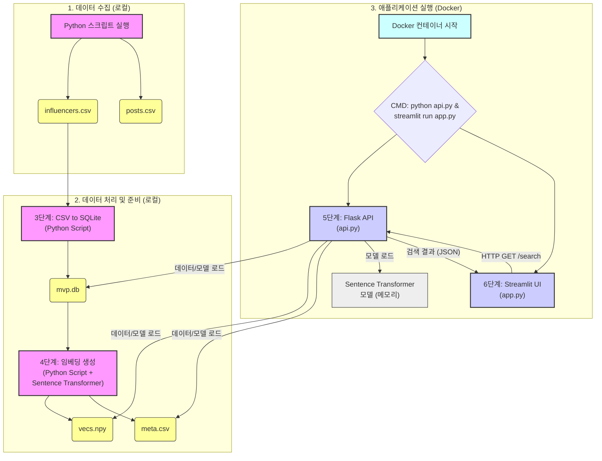

# 📈 인스타 인플루언서 검색 MVP (Sprint 2 - Week 1)

간단한 자연어 쿼리를 통해 인스타그램 인플루언서를 검색하는 MVP 프로젝트입니다. 텍스트 유사도 검색과 팔로워 수 필터링 기능을 제공합니다.

## Setup

1.  **저장소 복제:**
    ```bash
    git clone <repository_url>
    cd <repository_directory>
    ```
2.  **가상 환경 생성 및 활성화:**
    ```bash
    python -m venv .venv
    # Windows
    .\.venv\Scripts\activate
    # macOS/Linux
    source .venv/bin/activate
    ```
3.  **필요 라이브러리 설치:**
    ```bash
    pip install -r requirements.txt
    # (konlpy 사용 시 JDK 설치 및 JAVA_HOME 환경 변수 설정 필요)
    ```
4.  **.env 파일 작성:**
    *   프로젝트 루트에 `.env` 파일을 생성하고 다음 내용을 입력합니다.
      ```dotenv
      INSTAGRAM_USERNAME=your_instagram_username
      INSTAGRAM_PASSWORD=your_instagram_password
      ```

## 데이터 준비 (Data Pipeline)

1.  **인스타그램 데이터 스크래핑:**
    *   (선택사항) `scraper.py` 상단의 `TARGET_HASHTAGS`, `MAX_USERS_TO_COLLECT`, `HASHTAG_MEDIA_COUNT` 등을 조절합니다.
    *   스크립트를 실행하여 인플루언서 및 게시물 데이터를 수집합니다.
      ```bash
      python scraper.py
      ```
    *   (선택사항) `scraping_log.md` 파일에 실행 결과를 기록합니다.
2.  **SQLite 데이터베이스 로드:**
    *   스크래핑 결과를 SQLite 데이터베이스(`mvp.db`)에 저장합니다.
      ```bash
      python etl.py
      ```
3.  **임베딩 벡터 생성:**
    *   수집된 인플루언서의 자기소개를 벡터화하여 검색에 사용될 파일을 생성합니다.
      ```bash
      python embed.py
      ```
    *   이 과정은 `influencers.csv` 파일이 변경될 때마다 다시 실행해야 합니다.

## 실행 (Run Application)

1.  **Flask API 서버 실행:**
    *   API 서버를 백그라운드에서 실행합니다.
      ```bash
      # Windows (Git Bash 또는 WSL)
      export FLASK_APP=api.py
      flask run &

      # Windows (cmd) - 백그라운드 실행 방식이 다름 (start /b 사용 등)
      # set FLASK_APP=api.py
      # start /b flask run

      # macOS/Linux
      export FLASK_APP=api.py
      flask run &
      ```
2.  **Streamlit UI 실행:**
    *   웹 기반 사용자 인터페이스를 실행합니다.
      ```bash
      streamlit run app.py
      ```
    *   웹 브라우저에서 자동으로 열리는 Streamlit 앱 페이지에서 검색어를 입력하여 사용합니다.

## 주요 파일 설명

*   `scraper.py`: 인스타그램 데이터를 스크래핑하여 CSV 파일로 저장합니다.
*   `etl.py`: CSV 데이터를 SQLite DB(`mvp.db`)로 로드합니다.
*   `embed.py`: 인플루언서 자기소개 텍스트를 임베딩하여 `vecs.npy`와 `meta.csv`를 생성합니다.
*   `nlp_parse.py`: 자연어 쿼리를 분석하여 팔로워, 카테고리 등의 필터 조건을 추출합니다.
*   `api.py`: Flask 기반의 검색 API 서버입니다. 필터링 및 유사도 검색 로직을 포함합니다.
*   `app.py`: Streamlit 기반의 웹 UI입니다. 사용자가 검색어를 입력하고 결과를 확인합니다.
*   `requirements.txt`: 프로젝트 실행에 필요한 Python 라이브러리 목록입니다.
*   `.env`: 인스타그램 계정 정보 등 민감한 설정을 저장합니다.
*   `mvp.db`: 스크래핑된 데이터가 저장되는 SQLite 데이터베이스 파일입니다.
*   `vecs.npy`: 인플루언서 자기소개 임베딩 벡터 데이터입니다.
*   `meta.csv`: 임베딩 벡터 순서와 매칭되는 메타데이터입니다.
*   `scraping_log.md`: 스크래핑 강도 테스트 기록 파일입니다.

## Sprint 1 워크플로우

아래는 현재 프로젝트(Sprint 1)의 데이터 처리 및 애플리케이션 실행 흐름을 나타내는 다이어그램입니다.



**주요 구성 요소:**

*   **데이터 수집:** 로컬 환경에서 Python 스크립트를 실행하여 `.csv` 파일 생성 (현재 데이터 관련성 문제 있음)
*   **데이터 처리 및 준비:** 로컬 환경에서 `.csv` 파일을 SQLite DB로 변환하고, 사용자 이름 임베딩 벡터(`.npy`)와 메타데이터(`.csv`) 생성
*   **애플리케이션 실행 (Docker):**
    *   Docker 컨테이너는 Flask API 서버(`api.py`)와 Streamlit UI(`app.py`)를 함께 실행합니다.
    *   Streamlit UI는 사용자의 검색 요청을 받아 Flask API에 HTTP GET 요청을 보냅니다.
    *   Flask API는 미리 준비된 임베딩 벡터, 메타데이터, Sentence Transformer 모델을 로드하여 검색어와 가장 유사한 사용자 목록을 찾아 JSON 형태로 Streamlit UI에 반환합니다. 